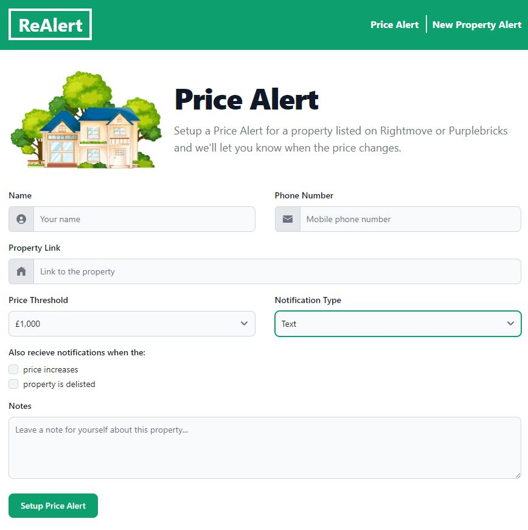
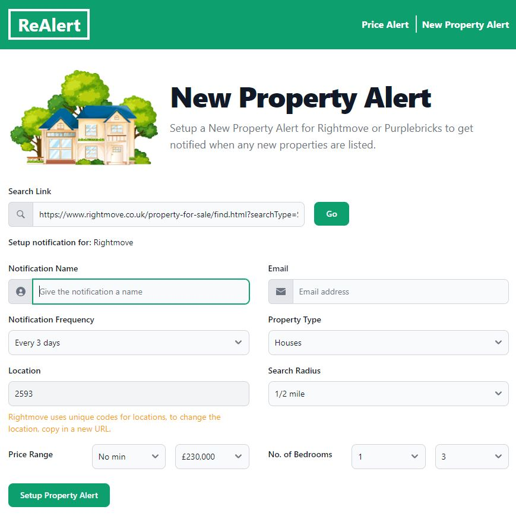
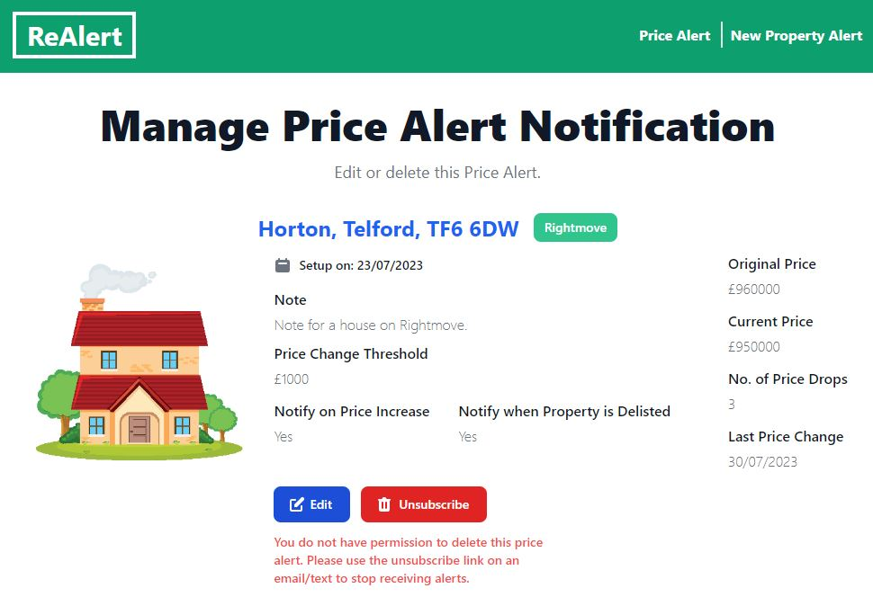

# ReAlert

## About

ReAlert is a web app built using C# with ASP.NET Core and Tailwind CSS, that allows you to setup notifications for properties on real estate websites (Rightmove and Purplebricks).
After a notification is set up, data is regularly scraped from the requested website and if any of the notification criteria are met an email is sent to the user using
<a href="https://aws.amazon.com/ses/" target="_blank">AWS Simple Email Service (SES)</a>.

## Features

**Price Alert:**  
Create an alert for a specific property listing and get notified when the property is delisted or the price increases or decreases.

 

**New Property Alert:**  
Create an alert with your property requirements and get notified when any new properties that match the search criteria are found.

 

**Edit/Delete Alerts**  
Edit delete existing Price and New Property alerts.

